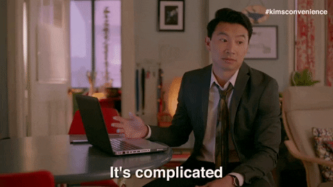
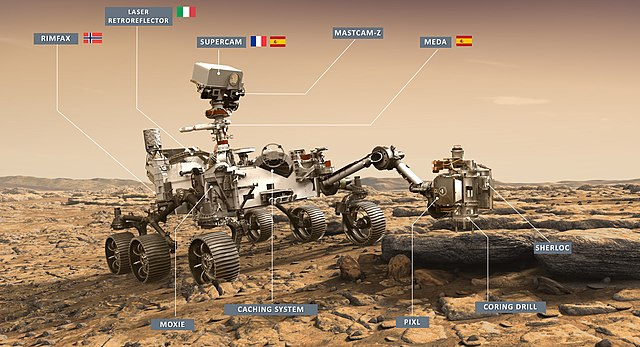
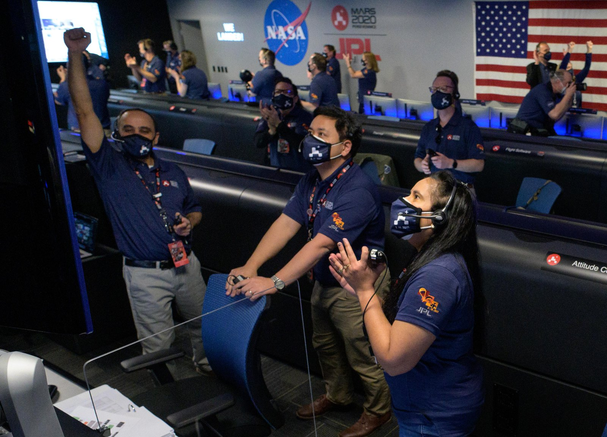
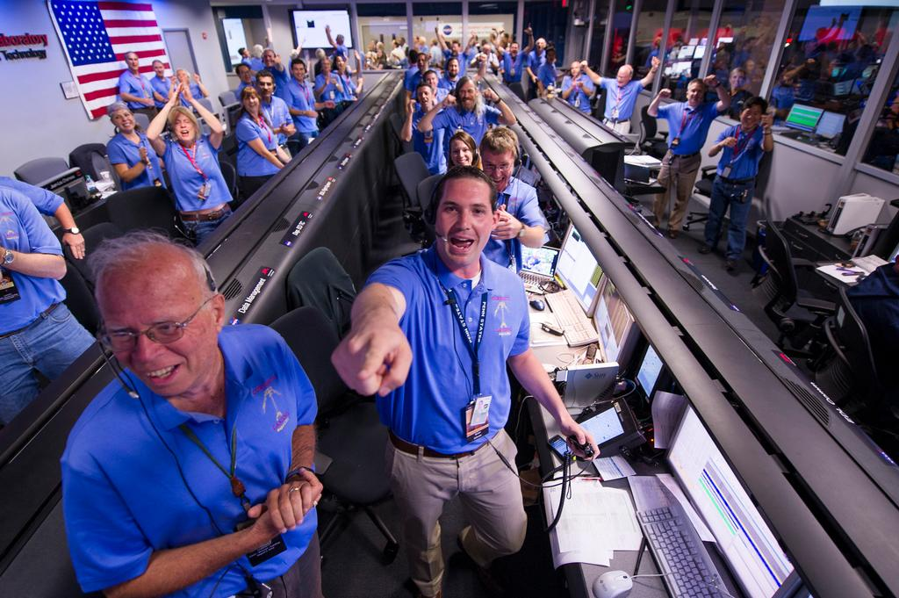

# 20210301 - Podcast: Digital. Innovation. Engineers.

## Noticias

En esta edición os traemos algunas noticias de actualidad que nos hubieran gustado que hubiesen sido todas buenas pero... bueno. Es lo que hay. 

### Elastic ya no es (tan) Open Source Software

[El anuncio llegó en San Valentín a través del blog de Elastic](https://www.elastic.co/blog/licensing-change). La verdad es que esto ya se veía venir cuando [AWS creo su propio fork](https://aws.amazon.com/blogs/opensource/stepping-up-for-a-truly-open-source-elasticsearch/). 

Cinco días después, la Open Source Initiative (OSI) dejó claro que [la SSPL no es una licencia de Software Libre](https://opensource.org/node/1099). Además, lo hizo con gran contundencia, afirmando que la SSPL restringe derechos básicos y que sólo es Open Source en apariencia. Los esfuerzos de Elastic por mantener su apariencia OSS-friendly no parecieron tener efecto (más bien, al contrario).

Por un lado, se entiende que Elastic quiera sacar algo del inmenso negocio que tienen los proveedores Cloud gracias a su trabajo. Por otro... Open Source es fuente abierta, amigo Elastic.

Este es un dilema que conocemos bien en esta casa. Flowable es un proyecto Open Source en el que constantemente estamos empleando tiempo y liberando código. Sin duda, este asunto trae de nuevo a la palestra la sostenibilidad del software libre como pilar fundamental (y fundacional) de muchas empresas. ¿Crees que estás apoyando suficientemente al software libre y a las empresas que lo hacen posible? Ahí os lo dejamos. 😉

### Bye bye JCenter

El 3 de febrero, [JFrog anunció que cerraba JCenter, GoCenter y ChartCenter](https://jfrog.com/blog/into-the-sunset-bintray-jcenter-gocenter-and-chartcenter/).

El más importante de los tres es JCenter, ampliamente utilizado por la comunidad Java. Concretamente, JCenter goza (gozaba) de gran popularidad entre los usuarios de Gradle y por ende, en desarrollos Android.

El motivo que JFrog declara es un poco ambiguo: "Agilizar la productividad de la plataforma JFrog". Tiene sentido pensar que mantener el servicio para esos repositorios no es viable para la compañia a diferencia de otros como [ConanCenter](https://conan.io/center/). Parece que la barra libre se nos está acabando. Recordemos [el anuncio de docker de reducir el tiempo de retención de imágenes en Docker Hub](https://www.docker.com/blog/scaling-dockers-business-to-serve-millions-more-developers-storage/) y [el fin del espacio infinito que Google Photos proporcionaba](https://blog.google/products/photos/storage-changes/).

### Soy Minerooo... 🎵

[Nvidia anunció su estrategia "pro-gamers" el pasado 18 de febrero](https://blogs.nvidia.com/blog/2021/02/18/geforce-cmp/).

El comunicado comienza con "We are gamers" y destila un espíritu justiciero. La situación actual del mercado del silicio en general y de las GPUs en particular es lamentable. Hay factorías de coches en todo el mundo que tienen que parar por falta de chips (en Valencia, sin ir más lejos). En el mercado de las GPUs, se da el agravante de que existe un montón de criptomineros dispuestos a pagar grandes sumas de dinero para obtener [sus gallinas de los huevos de oro](https://www.cryptocompare.com/mining/calculator/eth?HashingPower=200&HashingUnit=MH%2Fs&PowerConsumption=140&CostPerkWh=0.12&MiningPoolFee=1), es decir, las GPUs de última generación. No es casualidad que las criptomonedas como Ethereum estén basadas en que la gente tenga en sus manos una GPU medianamente potente. Y todo esto provoca el cabreo de gente que sólo que quiere jugar.

La solución de Nvidia pasa por bifurcar sus GPUs en dos líneas claramente separadas: GeForce para los Gamers y CMP (Cryptocurrency Mining Processor) para los mineros.

Para desincentivar que los alegres mineros sigan comprando GPUs destinadas al Gaming, van a capar los drivers de las tarjetas de la línea GeForce. Es de esperar que el precio y los costes de la línea CMP sea inferior. Hay que ser muy ingénuo para creer que sólo con software _inhackeable_ va a tener éxito esta estratégia.

Dicho esto, ¿Es Nvidia una ONG? Claro que no. Detrás de esta decisión existen buenas razones empresariales. Que estas razones acaben beneficiando a los gamers... el tiempo lo dirá. De momento, parece claro que Nvidia quiere evitar que las fluctuaciones del volátil mundo de las criptomonedas afecten a su flujo de ventas. No olvidemos que cuando las burbujas de la criptominería explotan, los (ya no tan) alegres criptomineros inundan el mercado con potentes GPUs semi-nuevas, que me las quitan de las manos, oiga. Lo de que las tarjetas CMP sólo puedan acabar en el vertedero cuando dejan de ser rentables tampoco lo han mencionado. Que el planeta ya si eso ya eso.

## Wrapping up

### Perseverancia no es el nombre de tu tía la del pueblo

A no ser que hayas estado metido en un chozo en mitad de la tundra, seguramente te habrás enterado de que 3 misiones espaciales han llegado a Marte durante el mes de febrero, la misión Hope Mars de Emiratos Árabes, la china Tianwen-1 y la estadounidense Mars 2020 con el Rover "Perseverance". Nos centraremos en esta última que es la que nos toca más de cerca.

Aparte del logro técnico que supone enviar un cacharro del tamaño de UN COCHE a Marte, cabe destacar que España ha aportado el sensor [MEDA](https://mars.nasa.gov/mars2020/spacecraft/instruments/meda/) (una estación meteorológica) y parte de [SuperCam](https://mars.nasa.gov/mars2020/spacecraft/instruments/supercam/) (un visor que es capaz de identificar la composición química de los materiales).

Además, viendo [el equipo de Mars 2020](https://mars.nasa.gov/mars2020/mission/team/) se puede apreciar que en [la NASA realmente tienen un compromiso por la diversidad](https://youtu.be/vUuUyYqI83Q?t=1467). Merece mención especial [la primera retransmisión en español del amartizaje a cargo de la ingeniera de la NASA Diana Trujillo](https://youtu.be/upLM5yGVKLg).

Dicho esto, observemos las imágenes del _Mission Control_ cuando se produjo el amartizaje.

¿No me digáis que no os recuerda cuando desplegáis con éxito en producción un viernes por la tarde? Salvando las distancias.astronómicas, claro. ¡Imagináos lo que debió sentir el equipo de Mars 2020! 😄

**¡Hasta la próxima entrega!**

## Créditos

-  Imagen de Ricky Gervais procedente de la serie ["After Life" de Netflix](https://www.netflix.com/es-en/title/80998491).
-  Sad frog by [Jeremy Jonkman](https://www.flickr.com/photos/jeremyjonkman/7946457328/)
-  GIF de Soy Minero procedente del film [Esa voz es una mina](https://www.filmaffinity.com/en/film177358.html).
-  Segunda imagen "It's complicated" proveniente de la serie [Kim's convenience](https://www.cbc.ca/kimsconvenience/)
-  Todas las imágenes de la misión Mars 2020 son propiedad de la NASA