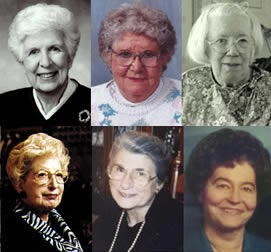
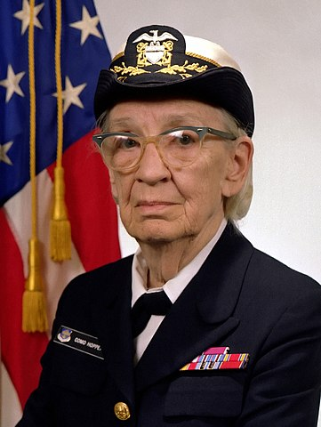
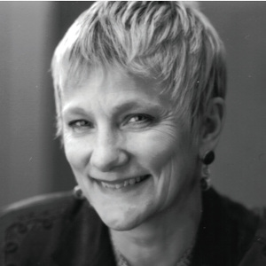
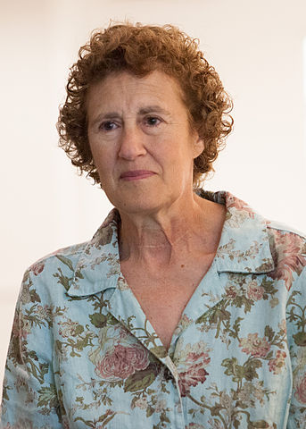
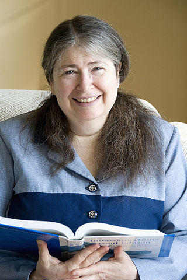

# Lista (absolutamente incompleta) de mujeres referentes en el mundo de la informática

En este artículo recopilamos una lista (que siempre va a estar incompleta) de mujeres que fueron, son y serán grandes referentes del mundo de la informática.

Sin más preámbulos, vamos al lío. 😊

## Ada Lovelace

[Ada Lovelace](https://en.wikipedia.org/wiki/Ada_Lovelace) es reconocida como la primera programadora de la historia. Desarrolló lo que podemos considerar como las bases de los modernos lenguajes de programación. En sus trabajos junto al ingeniero Charles Babbage y su "máquina analítica" [introdujo conceptos](https://en.wikipedia.org/wiki/Ada_Lovelace#/media/File:Diagram_for_the_computation_of_Bernoulli_numbers.jpg) que ahora nos parecen tan familiares como los algoritmos, las operaciones o las variables. ¡Y todo esto en la primera mitad del siglo XIX!

## El equipo de 6 programadoras de la computadora ENIAC.

Así es, las primeras personas que se encargaron de programar uno de los primeros ordenadores fueron mujeres. Se trató de un equipo de 6 mujeres: Betty Snyder Holberton, Jean Jennings Bartik, Ruth Lichterman Teitelbaum, Kathleen McNulty Mauchly Antonelli, Frances Bilas Spence y Marlyn Wescoff Meltzer. Su trabajo consistió en desarrollar los programas y ejecutarlos en el ENIAC. Principalmente, se trataba de cálculos de trayectorias balísticas aunque más adelanante se incluyeron otras funciones. A pesar de su enorme contribución durante la segunda guerra mundial, ninguna de ellas obtuvo reconocimiento hasta bien entrados los años 80.

Cabe destacar que estas 6 pioneras fueron seleccionadas de entre las más de 200 mujeres que se encargaban de realizar los cálculos con ayuda de calculadoras mecánicas. En aquella época, éste era uno de los pocos trabajos técnicos a los que las mujeres tenían acceso. Y el reto era enorme ya que prácticamente tuvieron que inventarlo **todo**. En palabras de Jean Jennings Bartik: ["The ENIAC was a son of a bitch to program"](https://vimeo.com/107667129#t=73s). Es difícil imaginar la magnitud del enorme reto técnico que supuso. 

Es una triste paradoja que ahora mismo las mujeres estén tan infrarepresentadas en informática, habida cuenta de como empezó todo y que está [ampliamente documentada la excelencia de su trabajo](http://eniacprogrammers.org).

## Grace Murray Hopper

El trabajo de [Grace Hopper](https://es.wikipedia.org/wiki/Grace_Murray_Hopper) fue uno de los más influyentes para la informática de todos los tiempos. Una absoluta pionera de la informática y la primera persona que programo el ordenador [IBM Mark I](https://es.wikipedia.org/wiki/Harvard_Mark_I). Se puede considerar a Grace Hopper una heredera del trabajo iniciado ni más ni menos que por Ada Lovelace ya que el Mark I se basó en las ideas de la máquina analítica de Charles Baggage. A veces la historia nos regala estos lazos poéticos.

A Grace Hopper le debemos la idea de que los programas se escriban en un lenguaje entendible por los humanos, como el inglés, y que existan programas que traducen de ese lenguaje al lenguaje máquina, es decir, los compiladores. Tuvo que luchar intensamente contra su entorno para poder llevar a cabo sus ideas. En aquella época se consideraba muy excéntrico que fuese posible comunicarse con los ordenadores como si fuesen personas que entienden un lenguaje humano. Sin duda, su inconfundible carácter y [sus dotes pedagógicas](https://youtu.be/9eyFDBPk4Yw) le fueron de gran ayuda. 

También participó activamente en la creación de COBOL, ya que éste se basó en el lenguaje que ella había creado previamente (FLOW-MATIC). Como anécdota curiosa, ella fue la primera persona que encontró un bug. De hecho, era eso, un bicho que se había colado en uno de los relés del computador.

## Margaret Hamilton

[Margaret Hamilton](https://es.wikipedia.org/wiki/Margaret_Hamilton_(cient%C3%ADfica)) es una investigadora científica que desarrolló la mayor parte de su carrera en la NASA, colaborando en las misiones Apolo que llevaron al ser humano a la luna.

Su trabajo fue crucial para alcanzar los objetivos en las misiones. También ayudó a salvar vidas mediante la gestión de los errores de software que se podían producir durante las misiones. Las increíblemente impredecibles condiciones de vuelo a las que se enfrentaban los astronautas ponían al límite el hardware y el software de las aeronaves. Se le atribuye a Hamilton [la creación de los fundamentos del software ultra-confiable](https://www.nasa.gov/home/hqnews/2003/sep/HQ_03281_Hamilton_Honor.html).

Por estos logros recibió el mayor reconocimiento civil que otorga el Presidente de Estados Unidos de América: La Medalla Presidencial de la Libertad.

## Adele Goldberg

[Adele Goldberg](https://en.wikipedia.org/wiki/Adele_Goldberg_(computer_scientist)) participó en el desarrollo del lenguaje de programación Smalltalk-80 en el que se introdujeron numerosos conceptos de la programación orientada a objetos. Su trabajo en Xerox PARC contribuyó a la creación del primer prototipo de ordenador personal con interfaz gráfica.

Adele fue la encargada de realizar una demo de Smalltalk a Steve Jobs. Lo hizo muy a su pesar porque ella sabía que iban a  "regalar" el trabajo de Xerox a Apple, tal y como sucedió. Steve Jobs quedó maravillado por los conceptos de Smalltalk. Quién sabe lo que habría pasado si Apple no hubiese tenido acceso al trabajo de Adele Goldberg y el resto del equipo de Xerox. En cualquier caso, podemos considerar que Adele Goldberg tuvo una enorme influencia en Macintosh y Windows tal y como los conocemos hoy en día.

## Anita Borg

[Anita Borg](https://en.wikipedia.org/wiki/Anita_Borg) fue una de las mujeres pioneras en el campo de la investigación en ciencias de la computación. Desarrolló su carrera como ingeniera e investigadora en Nixdorf, DEC y Xerox. Parte de su trabajo tuvo que ver con el desarrollo y la optimización de redes de comunicación.

En 1987 creó [Systers](https://en.wikipedia.org/wiki/Systers), la primera lista de correo para mujeres tecnólogas. También creó la serie de conferencias en honor a Grace Hopper para la celebración de la mujer en el mundo de la computación. Posteriormente, también creó el Instituto de Mujeres y Tecnología, que ahora lleva su nombre. El impacto cultural de Anita Borg ha sido enorme ya que fue la chispa que inició los movimientos para el reconocimiento de la mujer en el mundo de la tecnología que siguen surgiendo a día de hoy.

## Barbara Liskov

Seguro que conoces [el principio de substitución](https://es.wikipedia.org/wiki/Principio_de_sustitución_de_Liskov) de [Barbara Liskov](https://en.wikipedia.org/wiki/Barbara_Liskov). Y si no lo conoces, deberías. 🦆

Barbara Liskov desarrolló su carrera como investigadora principalmente en el MIT, donde sus trabajos fueron de gran influencia. Investigó en campos tan avanzados como la programación distribuida o las bases de datos orientadas a objetos. Ha sido de las poquísimas personas en recibir el Premio Turing y la Medalla John Von Neumann. Esto vendría a ser el equivalente a que te diesen el premio Nobel y que luego te lo volviesen a dar. 🔝🔝🔝

Como curiosidad, Barbara Liskov fue una de las 13 fundadoras de Systers, junto a Anita Borg.

## Radia Perlman

El trabajo de [Radia Perlman](https://es.wikipedia.org/wiki/Radia_Perlman) ha conseguido que podamos disfrutar de redes resistentes a fallos gracias a su protocolo [Spanning Tree](https://es.wikipedia.org/wiki/Spanning_tree). Sus trabajos de investigación y patentes han ayudado a desarrollar las redes tal y como las conocemos hoy en día. Aunque a ella no le gusta mucho (quizás por humildad), se la considera la "madre" de Internet.

Como nota curiosa, además fue pionera en la enseñanza de la programación para niños. Desarrolló un sistema de programación para niños muy pequeños, de entre 3 años y medio y cinco años. El sistema se llamaba TORTIS y consistía en programar un robot con forma de tortuga. Este es un detalle curioso que sólo sirve para poner de manifiesto [su absoluta genialidad](https://www.youtube.com/watch?v=ON553T1U1to&feature=youtu.be).

## En el tintero

Se han quedado en el tintero muchas cosas que contar sobre de muchas otras mujeres, todas ellas geniales. Quizás podría ser una buena costumbre ir incrementando esta lista en cada 8M. O mejor, cada vez que tengamos ocasión. Nunca nos van a sobrar buenos referentes. Sus historias son enormemente inspiradoras para todos y para todas.

